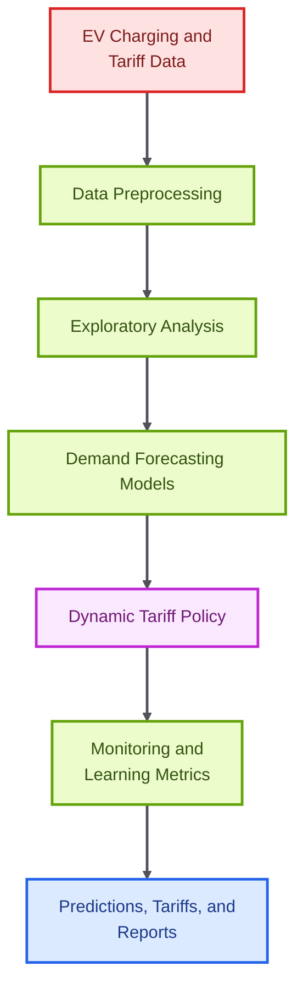

# Dynamic Tariff Optimization for EV Charging Networks

<p align="center">

  
  
  
  
  
</p>

<p align="center">
  <strong>A demand forecasting and dynamic-pricing analytics system for EV charging networks.</strong>
</p>

This project models EV charging tariff optimization as a closed-loop analytics problem: forecast demand, derive pricing recommendations, monitor outcomes, and improve the policy over time. The repository includes notebooks, results, metrics, and a written analytical report.

## Core Capabilities

- Preprocesses EV charging and tariff datasets for modeling.
- Forecasts localized demand using machine learning models.
- Generates dynamic tariff recommendations from predicted demand patterns.
- Produces monitoring metrics and result artifacts for review.

## Technical Architecture

The project is organized as an analytics workflow under the Analytics directory. Sequential notebooks handle preprocessing, exploration, demand prediction, tariff pricing, and monitoring, with CSV outputs for predictions and metrics.

## Architecture Diagram



## Technology Stack

- Pandas, NumPy, and SciPy for data preparation and analysis.
- scikit-learn, XGBoost, and LightGBM for predictive modeling.
- Matplotlib, Seaborn, and Plotly for visualization.
- Jupyter notebooks for reproducible analytical stages.
- CSV result artifacts for model outputs and pricing recommendations.

## Repository Structure

- `Analytics/notebooks/01_data_preprocessing.ipynb` - Data preparation workflow.
- `Analytics/notebooks/03_demand_prediction_agent.ipynb` - Demand prediction workflow.
- `Analytics/notebooks/04_tariff_pricing_agent.ipynb` - Tariff pricing workflow.
- `Analytics/results` - Generated predictions, tariffs, and metrics.
- `Analytics/requirements.txt` - Python dependencies.
- `Analytics/23411030_EV_Tariff_Optimization_OP26.pdf` - Project report.

## Getting Started

```bash
cd Analytics
python -m venv .venv
source .venv/bin/activate
pip install -r requirements.txt
```

```bash
jupyter notebook
```

## Professional Context

This project demonstrates applied analytics, demand forecasting, pricing strategy, and data-driven operations for energy infrastructure.
